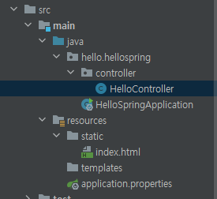
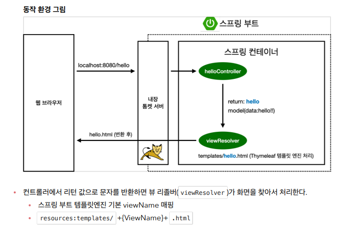

# View 환경설정


## Welcome Page 만들기

- resources/static/index.html
  - 해당 폴더가 장고의 template 폴더 역할을 하는 듯?
  - 해당 경로에 index.html 생성

- 스프링 부트가 스프링의 기능을 편리하게 사용할 수 있도록 만들어 놨지만.. 스프링 자체가 자바 웹 엔터프라이즈 자체라고 할 수 있을 정도로 방대하므로 다 외울수가 없음, 필요한 것을 찾는 능력 중요
  - 따라서 공식 레퍼런스를 많이 참고할 것
- [공식문서에서 웰컴페이지에 대해 알아보자](https://docs.spring.io/spring-boot/docs/2.3.1.RELEASE/reference/html/spring-boot-features.html#boot-features-spring-mvc-welcome-page)
  - Spring Boot supports both static and templated welcome pages. It first looks for an `index.html` file in the configured static content locations. If one is not found, it then looks for an `index` template. If either is found, it is automatically used as the welcome page of the application.


## thymeleaf 템플릿 엔진

- [thymeleaf 공식사이트]([Thymeleaf](https://www.thymeleaf.org/))

- [스프링 공식 튜토리얼]([Getting Started | Serving Web Content with Spring MVC](https://spring.io/guides/gs/serving-web-content/))
- [스프링부트메뉴얼]([Spring Boot Features](https://docs.spring.io/spring-boot/docs/2.3.1.RELEASE/reference/html/spring-boot-features.html#boot-features-spring-mvc-template-engines))


## controller

- 장고의 view와 같은 역할
- 프로젝트 폴더에 `controller` 패키지 생성
  - `HelloController` 클래스 생성

- `@Controller` 작성



```java
package hello.hellospring.controller;

import org.springframework.stereotype.Controller;
import org.springframework.ui.Model;
import org.springframework.web.bind.annotation.GetMapping;

@Controller
public class HelloController {

    @GetMapping("hello") // 이부분이 url이 됨 즉, /hello로 접근하면 해당 메서드를 호출
    public String hello(Model model) {
        // 앞의 "data"가 html에서 사용하게될 이름
        // 뒤의 "hello!"가 실제 데이터의 값
        // 스프링이 model을 만들고 model에 데이터를 넣어주는 식임
        model.addAttribute("data", "hello!");
        // resources/templates/hello 라는 파일을 실행시켜라는 뜻의 return
        return "hello";
    }
}
```

- resources/templates/에
  - hello.html 생성

```html
<!DOCTYPE HTML>
<html xmlns:th="http://www.thymeleaf.org">
<head>
  <title>Hello</title>
  <meta http-equiv="Content-Type" content="text/html; charset=UTF-8" />
</head>
<body>
<!-- ${data} 는 넘겨받은 모델의 키값! -->
<p th:text="'안녕하세요. ' + ${data}" >안녕하세요. 손님</p>
<!--th : thymeleaf 위에서 선언해줬기 때문에 문법 사용 가능-->
</body>
</html>

```

- 장고에선 urls.py에서 url과 view(controller)를 연결시켜 줬는데
- 스프링부트의 경우 메서드에 `@GetMapping` 어노테이션을 붙여서 해당 역할을 수행
  - `Get`이 http 메서드를 의미 다른 http 메서드(Post, Put, Delete ... )도 존재함!
- 장고의 경우 view(controller)의 메서드에서 template으로 넘겨준 데이터를 `{{}}`를 사용해서 받았음
- 스프링 부트의 경우 `th:`를 통해 thymeleaf 문법을 사용하고 `${}`를 사용해 데이터를 받음



- 이미지출처 : 스프링 입문 - 코드로 배우는 스프링 부트, 웹 MVC, DB 접근 기술 - 이명한

