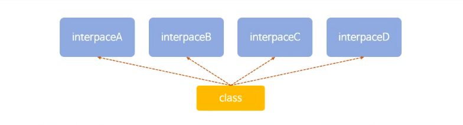

# 인터페이스

- 클래스와 외형적으론 비슷하지만
- 클래스처럼 객체를 생성, 메서드 호출등이 불가능
- 몰라도 문제는 없지만 좀더 세련되고 단단한 코드 작성 가능


## 인터페이스란

- 클래스와 달리 객체를 생성할 수는 없음
- 클래스에서 구현해야 하는 작업 명세서
- 클래스의 경우
  - 클래스에서 생성(new)과정을 거쳐 객체를 매모리에 생성, 레퍼런스로 접근해 속성과 메서드 사용
- 인터페이스
  - 클래스에서 인터페이스를 구현하는 단계를 거침
    - 인터페이스는 껍데기만 갖고 있고 상세한 내용은 없음
    - 즉 선언만 되어있음
    - 이걸 클래스에서 좀더 명확하게 정의해줌
  - 이 클래스로부터 객체를 생성함


## 인터페이스를 사용하는 이유

- 인터페이스를 사용하는 이유는 많음
- 가장큰 이유는 개체가 다양한 자료형(타입)을 가질 수 있기 때문



- 만약에 한 클래스에 인터페이스 A B C D가 있다고 가정
- 인터페이스는 어떠한 작업이 있다고 알려주는 명세서의 역할
- 만약 각각의 인터페이스에 어떠한 기능이 있으면
- 클래스는 인터페이스 A B C D의 기능을 다 구현 가능
- `implements` 키워드 사용해서 사용


## 인터페이스 구현

```java
// InterfaceA
package testPjt;

public interface InterfaceA {
	
	// 이렇게 선언만 하고 정의는 하지 않음
	public void funcA();
	
}
```

```java
// InterfaceB
package testPjt;

public interface InterfaceB {
	
	// 이렇게 선언만 하고 정의는 하지 않음
	public void funcB();
	
}
```

```java
// InterfaceClass
package testPjt;

// implements를 사용해 인터페이스 사용
// 다형성 -> 여러개의 인터페이스 사용 가능
public class InterfaceClass implements InterfaceA, InterfaceB{
	
	public InterfaceClass() {
		System.out.println("interfaceClass constructor");
	}
	
	// 반드시 사용하는 인터페이스의 메서드는 재정의 해줘야함, 의무사항!
	@Override
	public void funcA() {
		System.out.println("this is function A");
		
	}

	@Override
	public void funcB() {
		System.out.println("this is function B");
		
	}
	
}
```

```java
// MainClass
package testPjt;

public class Main {
	
	public static void main(String[] args) {
		
		InterfaceA ia = new InterfaceClass();
		InterfaceB ib = new InterfaceClass();
		
		// ia는 InterfaceClass를 통해 만들어짐
		// 그러나 ia의 데이터 타입은 InterfaceA임
		// 따라서 클래스에 여러개의 메서드가 있어도 InterfaceA를 재정의한 메서드만 사용 가능
		ia.funcA();
		ib.funcB();

	}
}
```


## 장난감 인터페이스

- Interface를 이용하면 객체가 다양한 자료형(타입)을 가질 수 있음!!
- 인터페이스를 사용하면 객체의 타입이 확장될 수 있다.
  - 다형성으로 다양한 데이터 타입 가질 수 있음
- 인터페이스에서 제공해주는 메서드에 따라 클래스의 성격에 맞게 다양하게 구현 가능

```java
// Toy (interface)

package com.java.toy;

public interface Toy {
	
	public void walk();
	public void run();
	public void alarm();
	public void light();
	
}
```

```java
// ToyRobot

package com.java.toy;

public class ToyRobot implements Toy {

	@Override
	public void walk() {
		System.out.println("robot walk");
		
	}

	@Override
	public void run() {
		System.out.println("robot run");
		
	}

	@Override
	public void alarm() {
		System.out.println("robot alarm");
		
	}

	@Override
	public void light() {
		System.out.println("robot light");
		
	}
}
```

```java
// ToyAirplane

package com.java.toy;

public class ToyAirplane implements Toy{

	@Override
	public void walk() {
		System.out.println("airplane walk");
		
	}

	@Override
	public void run() {
		System.out.println("airplane run");
		
	}

	@Override
	public void alarm() {
		System.out.println("airplane alarm");
		
	}

	@Override
	public void light() {
		System.out.println("airplane light");
		
	}
	
	
}
```

```java
// MainClass

package test;

import com.java.toy.*;

public class MainClass {
	
	public static void main(String[] args) {
		
		// 두 객체는 다른 클래스로 만들어 졌지만
		// Toy라는 인터페이스로 데이터 타입은 같음
		Toy robot = new ToyRobot();
		Toy airplane = new ToyAirplane();
		
		// 따라서 같은 데이터 타입이기 때문에 같은 배열에 담을 수 있음
		Toy toys[] = {robot, airplane};
		
		for (int i = 0; i < toys.length; i++) {
			toys[i].walk();
			toys[i].run();
			toys[i].alarm();
			toys[i].light();
			
			System.out.println("----");
		}
		
	}
}
```

